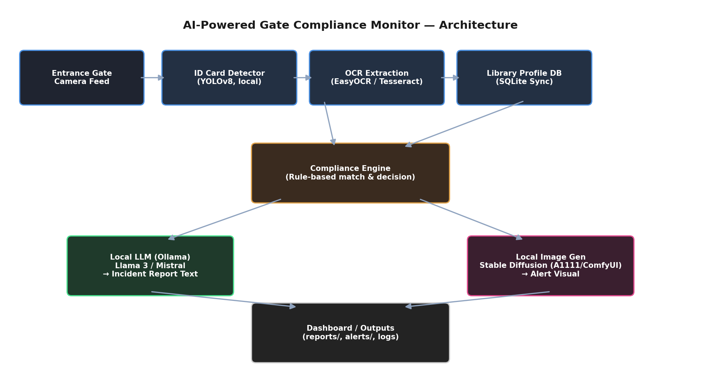
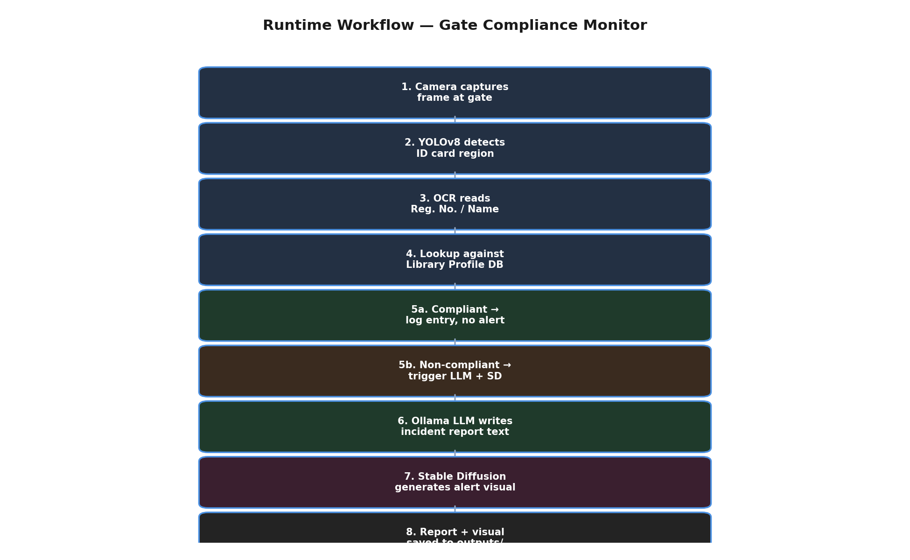

# 🎓 AI-Powered Gate Compliance Monitor

An offline, university-focused AI application that automatically detects student ID cards at entrance gates, syncs against the existing library profile database, and flags non-compliant entries in real time — generating both a written incident report and a visual alert graphic entirely with **local AI models**.

---

## Problem Statement

University entrance gates are typically monitored manually, relying on security staff to visually check ID cards against expiry dates and library records. This is slow, inconsistent, and easy to bypass (expired cards, cards belonging to someone else, or cards not registered in the system at all often go unnoticed during rush hours).

This project automates that check end-to-end: a camera frame at the gate is analyzed, the ID card is detected and read, the reg. no. is cross-checked against the library system's records, and — if something doesn't match — the system automatically drafts an incident report and a visual alert for security staff, without any manual lookup.

Per course constraints, the entire pipeline runs **locally**: no cloud AI APIs (OpenAI, Gemini, Claude, etc.) are used anywhere.

---

## Features

- **Automatic ID card detection** from a gate-camera frame (YOLOv8, local)
- **OCR extraction** of registration number / name from the detected card (EasyOCR, local)
- **Live sync** against the existing library system's profile export (CSV → SQLite)
- **Compliance decision** — active & valid vs. expired / unregistered / inactive
- **Local LLM incident reports** — Ollama (Llama 3 / Mistral) drafts a short, professional report the moment a non-compliant entry is detected
- **Local image generation alerts** — Stable Diffusion (AUTOMATIC1111 / ComfyUI) generates a visual warning graphic for every flagged entry, combining **text and image generation in a single workflow**
- **Streamlit dashboard** to simulate gate scans and view results live
- **Fully runnable demo mode** — synthetic library data + ID card images included, with graceful fallbacks if Ollama/Stable Diffusion aren't running, so the whole pipeline works even before those services are set up

---

## Architecture



The pipeline has three logical stages:
1. **Perception** — YOLOv8 detects the card region, EasyOCR reads the reg. no.
2. **Decision** — the Compliance Engine looks up the reg. no. in a local SQLite mirror of the library system and decides compliant / non-compliant.
3. **Generation** — on a non-compliant result, the local LLM (Ollama) writes the incident report and local Stable Diffusion generates the alert visual, both saved under `outputs/`.

### Runtime Workflow



---

## Installation & Usage

### 1. Clone and install dependencies
```bash
git clone <your-repo-url>
cd <RegNo>
pip install -r requirements.txt
```

### 2. Generate demo data (dummy library DB + synthetic ID cards)
```bash
python -m src.dummy_data_generator
```
This creates:
- `data/library_profiles.csv` — a synthetic export mimicking the library system (25 records, ~20% expired to exercise the flagging logic)
- `data/sample_id_cards/*.png` — synthetic ID card images to scan, including a few with reg. numbers that don't exist in the DB

### 3. (Optional but recommended) Set up the local models

**Local LLM — Ollama:**
```bash
# Install from https://ollama.com
ollama pull llama3
ollama serve
```

**Local image generation — AUTOMATIC1111 WebUI:**
```bash
# https://github.com/AUTOMATIC1111/stable-diffusion-webui
./webui.sh --api        # Linux/Mac
# or webui-user.bat --api   on Windows
```
> If either service isn't running, the app still works — `llm_report.py` and `image_alert.py` fall back to a template report / a PIL-drawn placeholder alert card respectively, so the workflow is always demonstrable.

**Local ID card detector — YOLOv8 (optional):**
The detector runs in mock mode (treats the whole frame as the card) until you train and drop weights at `models/best.pt`. Instructions are in `src/detector.py`.

### 4. Run the app
```bash
streamlit run app.py
```
Open the local URL Streamlit prints, pick a sample card from the sidebar (or upload your own), and click **Scan at Gate**.

---

## Screenshots

_Add screenshots of the running dashboard here — see `docs/screenshots/`._

| Compliant scan | Non-compliant scan |
|---|---|
| `docs/screenshots/compliant.png` | `docs/screenshots/non_compliant.png` |

---

## Demo Video

A short walkthrough of the working application is at `demo/demo.mp4` (record a 2-3 minute screen capture showing: dummy data generation → a compliant scan → a non-compliant scan with the generated LLM report and Stable Diffusion alert visual).

---

## Repository Structure

```
Repository(Reg. No.)/
├── README.md              ← this file
├── LICENSE
├── .gitignore
├── requirements.txt
├── app.py                 ← Streamlit dashboard (entry point)
├── src/
│   ├── detector.py         ← YOLOv8 ID card detection (with mock fallback)
│   ├── ocr_reader.py        ← EasyOCR text extraction (with mock fallback)
│   ├── db_manager.py         ← Library CSV → SQLite sync + lookup
│   ├── llm_report.py          ← Local LLM (Ollama) incident report generation
│   ├── image_alert.py          ← Local Stable Diffusion alert visual generation
│   ├── compliance_engine.py     ← Orchestrates the full pipeline
│   └── dummy_data_generator.py   ← Generates demo library DB + sample ID cards
├── docs/
│   ├── architecture.png
│   ├── workflow.png
│   ├── make_architecture.py    ← regenerate architecture.png
│   ├── make_workflow.py        ← regenerate workflow.png
│   └── screenshots/
├── models/                 ← place trained YOLOv8 weights here (best.pt)
├── data/
│   ├── library_profiles.csv
│   └── sample_id_cards/
├── outputs/
│   ├── reports/            ← LLM-generated incident reports (.txt)
│   └── alerts/             ← Stable-Diffusion / placeholder alert visuals (.png)
└── demo/
    └── demo.mp4
```

---

## Notes on Local-Only Constraint

Every model in this pipeline runs on the local machine:
- **YOLOv8** (`ultralytics`) — runs locally, no API calls
- **EasyOCR** — local OCR, downloads open-source weights once, no cloud inference
- **Ollama** (Llama 3 / Mistral) — served from `localhost:11434`
- **Stable Diffusion** (AUTOMATIC1111 / ComfyUI) — served from `localhost:7860`

No OpenAI, Gemini, Claude, or other cloud AI API is called anywhere in this codebase.
